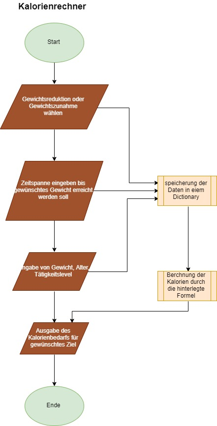
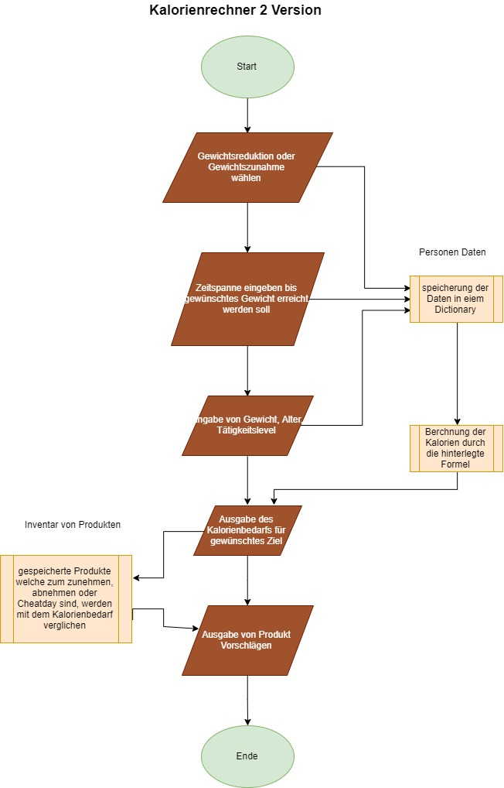

###READ ME###

# Projekt für PROG

### Ausgangslage

##### **IDEE 1**
Einen Programm schrieben welches dem User auf z.B. einer Internetseite bei Fragen weiterhilft.

##### **IDEE 2**
Ein Programm welche z.B. auf einer Internetseite eingebunden ist und dem User Hilft bei der Kalorien berechnung und z.B. die Produkte vorschlägt welcher der User dazu benutzen könnte.

### Funktion / Projektidee

##### **IDEE 1**
Ich möchte entweder einen Chat Bot erstellen der auf Fragen die der User stellt antworten kann. Ich weiss jedoch nicht genau wie ich dies realisieren sollte.

##### **IDEE 2**
Ich will einen Kalorienrechner erstellen bei welchem man eingeben kann ob man abnehmen oder zunehmen will. Dieser kann auch durch die eingebenen Daten berechenen wie der Tagesbedarf an Kalorien ist. Zudem kann das Programm z.B. auf einem Fitness Shop direkt die entsprechenden Produkte für sein Ziel vorschlägt.
### Workflow
##### Dateneingabe
##### **IDEE 1**
  - Der User kann eine Frage eingeben 
  - Der User kann Antworten eingeben

##### **IDEE 2**
  - Der User gibt seine persönlichen Datein ein
  - Der User gibt Anworten zu Fragen ein

##### Datenverarbeitung
##### **IDEE 1**
  - Das Programm vergleicht die Eingabe des Users mit der Datenbank und generiert dadurch eine Antwort auf die Frage

##### **IDEE 2**
  - Das Programm berechnet mit den eingegebenen Daten und einer hinterlegten Mathematischen Formel die Kalorien.
  
##### Datenausgabe
##### **IDEE 1**
  - Mit den eingegebenen Daten antwortet der Chat Bot auf eine Frage

##### **IDEE 2**
  - Mit den eingegebenen Daten können die Bedarfskalorien des Users berechnet werden
  - Mit den eingegebenen Daten kann das Programm Produkte aus dem Shop dem User vorschlagen

##### **Ablaufdiagramm Variante 1**

 

##### **Ablaufdiagramm Variante 2**

 
